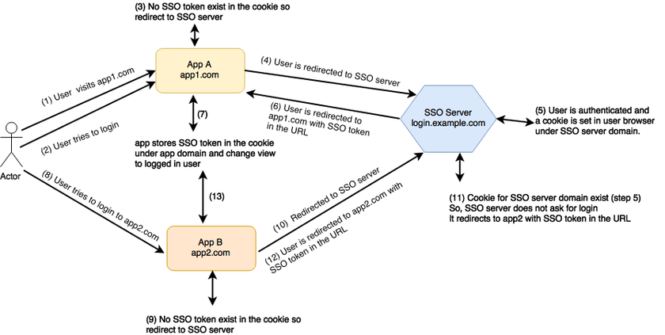

# Spring Boot Single Sign-on Example Application

# What is Single sign-on?

Single sign-on (or SSO) allow users to use a single set of credentials to login into multiple related yet independent web applications. SSO also includes not asking users to login again into application B if they have already logged into application A given that A and B use SSO. SSO is achieved by implementing a centralised login system that handles authentication of users and share that information with applications that need that data.

The most common example of SSO that most of us use is by Google. When you use login to any Google service, you are redirected to https://accounts.google.com for authentication. For example, if you go to gmail.com you will be redirected to https://accounts.google.com for login. Same is the case when you to try to sign in to Youtube. After successful authentication, users are redirected to the application.

The requirement for SSO is common in enterprises where different applications come into the system at different times . Some applications are developed by different business units in isolation or some come through acquisitions. Each system come packaged with their own identity systems. Having different identity systems not only make it difficult for end users to use the applications but it also makes it difficult for an enterprise to link multiple identities to a user so that they can view a user as a single customer. Having a centralised login system is the first step to gain better understanding of the end user.

# How does SSO authentication works?
This section is not talking about a specific SSO server implementation. We will cover that when we will look at Spring Security OAuth. In this section, we will understand the basic idea behind most SSO systems. Below is a diagram that depicts the SSO flow. We have two applications app1.com and app2.com. There is a centralised SSO server login.example.com.

